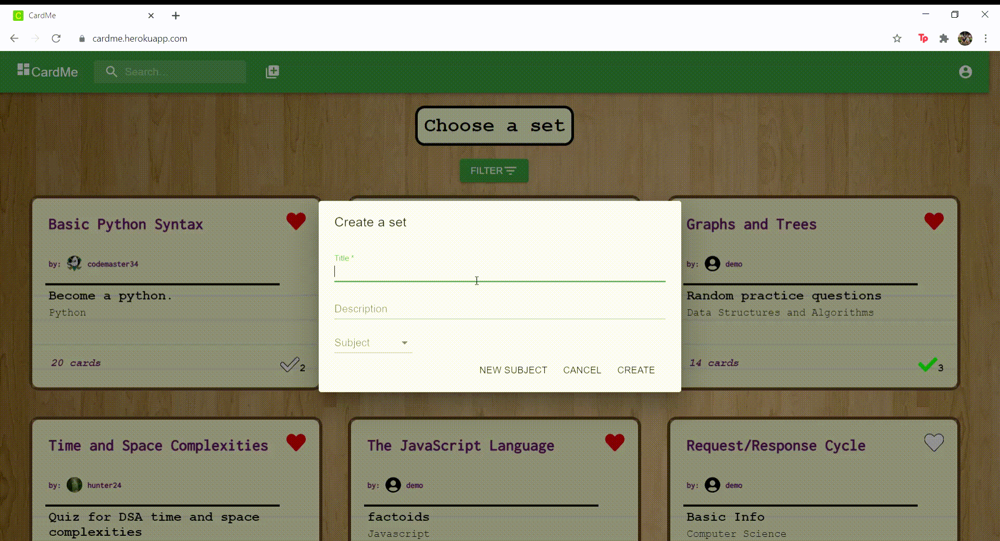

<div align="center">


# CardMe
## A Flashcard and Study Application

**Developer:**
David Lee


**Table of Contents**

[About](#about-cardme) | [Features](#features) | [Installation](#installation) | [Contact](#contact)


<a href="https://cardme.herokuapp.com/">
Demo the live site!
</a>
</div>

---

<div align="center">

## About CardMe

</div>


CardMe is a flashcard / study application that allows users to create and maintain sets of flashcards or use sets created by other users. Users can like and favorite specific sets in order to refer to them at a later time. Features include a search bar that can filter particular subjects, sets, cards, and other users. Users may also participate in a randomized multiple-choice quiz specific to the contents of each set. Enjoy!

<br clear="both">

<div align="right">

**Database Schema**
>

</div>

<div align="center">

## Features

</div>


* Navigate through all the sets created by CardMe users
* Like and favorite sets in order to build a sets credibility or save it for future reference

<br clear="both">

---



* Create a set and its corresponding cards (pin to an existing subject or create a new one)

<br clear="both">

---

* Use the search bar to query and filter the existing database for related sets, subjects, cards, and users
* Quiz yourself using the randomized, multiple-choice quiz specific to each set and constructed with the contents of its flashcards


<div align="center">

## Installation

</div>

1. Clone this repository
    ```bash
    git clone https://github.com/dyclee/flashcardApp.git
    ```

2. Install dependencies
    ```bash
    pipenv install --dev -r dev-requirements.txt && pipenv install -r requirements.txt
    ```

3. Create `.env` file (Example is provided within repo)

4. Set up Postgres database based on `.env` credentials

5. Enter pipenv environment, migrate associated database, and run the flask application

   ```bash
   pipenv shell
   ```

   ```bash
   flask db upgrade
   ```

   ```bash
   python seeder.py
   ```

   ```bash
   flask run
   ```

6. To run the application in development, run `npm start` within the `react-app` directory

---

<div align="center">

## Contact

Please feel free to reach out!

</div>

### David Lee
*(Full-stack developer, Open to work)*

<a href="readme/Lee_David_Resume(v2.0).pdf" download></a>
[](mailto:dyclee@umich.edu)
[](https://www.linkedin.com/in/daveyclee/)
[](https://angel.co/u/david-lee-332)
[](https://github.com/dyclee)
